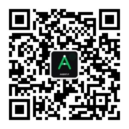

# Agently.top

每日 AI / 开源 / 科技信息聚合 · 中文智能摘要 · 卡片式资讯流 · 微信公众号自动发布

线上地址：[https://agently.top](https://agently.top)

---

## 它是什么

Agently.top 每天自动从 9 个信息源抓取最新内容，通过 OpenAI 兼容接口（默认 `MiniMax-M3`）生成中文摘要与开发关注点，并以卡片流形式呈现。同时支持将每日精选内容自动发布到微信公众号草稿箱。

信息源包括：GitHub Trending 日榜/周榜、Hacker News、Linux.do、少数派、钛媒体、OpenAI、Anthropic、InfoQ AI。

---

## 主要特性

- **每日自动采集**：9 大源独立抓取、独立容错，单一源失败不影响整体输出
- **AI 中文摘要**：针对 AI 开发工程师 / 软件开发工程师生成摘要与可执行建议
- **分层记忆系统**：跨天主题追踪，自动识别跟进报道与趋势演变
- **微信公众号发布**：自动入库草稿，支持 AI 生成封面图与固定摘要
- **邮件推送（可选）**：按调度时间自动发送每日摘要邮件
- **Web + API**：Vue 3 卡片流前端，FastAPI 只读接口，RSS 输出
- **访问统计**：轻量自建统计，汇总 UV/PV/Referer

---

## 快速开始

```bash
# 安装依赖
pip3 install -r requirements.txt
cd frontend && npm install && cd ..

# 配置环境变量
cp .env.example .env
# 编辑 .env，填入 OPENAI_API_KEY、REDIS_URL 等必要配置

# 跑一次采集
python3 main.py

# 启动 API 服务
python3 -m uvicorn api:app --host 0.0.0.0 --port 8000
```

完整部署、环境变量与运维说明见 [`docs/setup-and-config.md`](docs/setup-and-config.md)。

---

## 关注微信公众号

扫码关注 **Agently.top** 公众号，每日获取 AI 开发资讯：



---

## 相关文档

- [部署与配置指南](docs/setup-and-config.md)
- [RSS/API 接口说明](docs/rss-api-guide.md)
- [环境变量示例](.env.example)

---

## License

[MIT](LICENSE)
